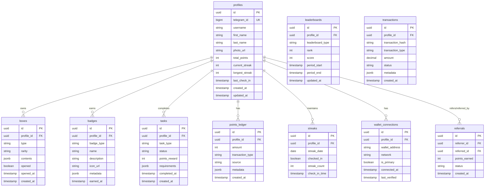

# StreakFarm Telegram Mini App - Architecture

This document provides a comprehensive overview of the StreakFarm Telegram Mini App architecture, including all system components, data flows, and integrations.

## System Overview

StreakFarm is a gamified Telegram Mini App built with a modern tech stack that combines web technologies with blockchain integration. The system enables users to build streaks, earn rewards, and connect their TON wallets.

## High-Level Architecture

## Detailed Component Architecture

## Database Schema

## Authentication Flow

## TON Wallet Connection Flow

## Streak Check-In Flow

## Points and Rewards Flow

## Edge Functions Overview

## Real-time Updates Architecture

## Technology Stack

### Frontend
- **Framework**: React 18+
- **Build Tool**: Vite
- **Language**: TypeScript
- **Styling**: Tailwind CSS
- **UI Components**: Custom components + Headless UI
- **State Management**: React Query + Context API
- **Routing**: React Router
- **Telegram Integration**: @twa-dev/sdk
- **TON Integration**: @tonconnect/ui-react
- **HTTP Client**: Axios / Fetch API
- **WebSocket**: Supabase Realtime Client

### Backend
- **Platform**: Lovable Cloud / Supabase
- **Runtime**: Deno (Edge Functions)
- **Database**: PostgreSQL 15+
- **Auth**: Supabase Auth with Telegram provider
- **Storage**: Supabase Storage
- **Realtime**: Supabase Realtime (WebSocket)
- **Security**: Row Level Security (RLS) policies

### Blockchain
- **Network**: TON (The Open Network)
- **Wallet Connection**: TON Connect 2.0
- **SDK**: @ton/ton, @ton/core
- **Smart Contracts**: FunC (for future NFT/token features)

### External APIs
- **Telegram Bot API**: User verification, bot interactions
- **TON API**: Blockchain queries, transaction verification
- **TON Connect Bridge**: Wallet communication

## Security Considerations

## Deployment Architecture

## Data Flow Examples

### Example 1: New User Onboarding

### Example 2: Referral Flow

## Scalability Considerations

1. **Database Scaling**
   - Connection pooling via PgBouncer
   - Read replicas for query distribution
   - Partitioning for large tables (points_ledger, streaks)
   - Indexes on frequently queried columns

2. **Edge Functions**
   - Stateless design for horizontal scaling
   - Automatic scaling based on load
   - Caching layer for frequently accessed data
   - Rate limiting per user/IP

3. **Real-time Updates**
   - Channel-based subscriptions
   - Selective updates (only changed fields)
   - Batch notifications for bulk operations
   - Client-side debouncing

4. **Caching Strategy**
   - CDN for static assets
   - Redis for session data (future)
   - Application-level caching for leaderboards
   - Browser caching for user profiles

## Future Enhancements

- **NFT Integration**: Mint badges as NFTs on TON blockchain
- **Token Economy**: Native $STREAK token for rewards
- **P2P Challenges**: User-to-user streak competitions
- **Social Features**: Friends list, activity feed
- **Advanced Analytics**: User behavior tracking, A/B testing
- **Push Notifications**: Via Telegram Bot API
- **Multi-language Support**: i18n implementation
- **Offline Mode**: Progressive Web App capabilities

## Conclusion

This architecture provides a scalable, secure, and maintainable foundation for the StreakFarm Telegram Mini App. The separation of concerns between frontend, backend, and blockchain layers allows for independent scaling and updates while maintaining a cohesive user experience.
